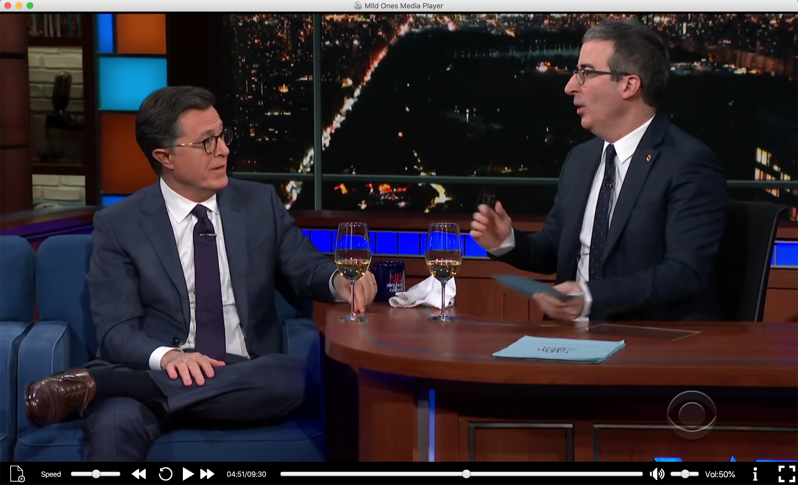

# Media Player Project (CSC 439)

## Team: The Mild Ones

## Members:
* Tristan Breetz
* Sam Hogan
* Emily Grace
* Josh Laffoon
* Reece Wienandt
* Daniel Herr

## Project Description
Our project is a desktop media player that can open and play .mp4 and .flv video files as well as .mp3 audio files. It has functionality that allows the user to play and pause the media and move to different locations. It also lets you adjust the playback speed and volume. The project is written in Java and uses the JavaFX platform.

## Running the application
To run the application, go to the `/student/src/` directory and execute the commands `javac MediaPlayerApplication.java` followed by `java MediaPlayerApplication`

## Issues/Enhancements Overview
Our first priority is to refactor the code to make it more maintainable and extensible. The code for the media player is written entirely in a single .java source file. The methods are very long and the code in general violates many software design principles. The refactoring will include breaking up methods, forming new classes out of existing code, cleaning up code logic, and adding comments. The media player also has several bugs that need to be fixed, such as throwing errors when opening some files and unresponsive UI. Once the current bugs are fixed, we will move on to enhancements and new features. These will include a clean and modern user interface, support for more file types, streaming video support, and an audio visualizer for audio files.

